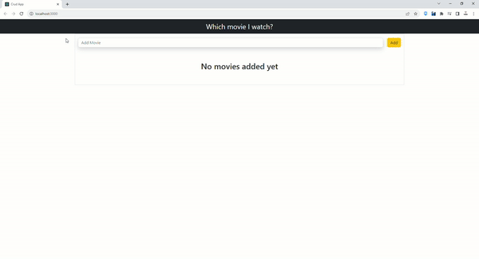

# Movie Tracking Application

This is a simple web application built with React that allows you to track the movies you want to watch. You can add new movies to your list, mark them as watched, edit their titles, and delete them if needed.

## Table of Contents

- [Getting Started](#getting-started)
  - [Prerequisites](#prerequisites)
  - [Installation](#installation)
- [Usage](#usage)
  - [Adding a Movie](#adding-a-movie)
  - [Marking a Movie as Watched](#marking-a-movie-as-watched)
  - [Editing a Movie Title](#editing-a-movie-title)
  - [Deleting a Movie](#deleting-a-movie)
- [Built With](#built-with)
- [License](#license)


## Screen




## Getting Started

### Prerequisites

Before you begin, ensure you have the following installed:

- Node.js: [Download Node.js](https://nodejs.org/)
- npm (Node Package Manager): This comes bundled with Node.js.

### Installation

1. Clone the repository to your local machine:

   ```bash
   git clone <repository-url>

2. Navigate to the project folder:

    cd movie-tracking-app

3. Install the required npm packages:

    npm install

4. Start the development server:

    npm start

The application should now be running on http://localhost:3000.

## Usage

### Adding a Movie
To add a movie to your list, follow these steps:

In the input field at the top of the page, enter the title of the movie you want to add.

Click the "Add" button or press Enter. The movie will be added to your list with the current date and marked as not watched.

A success notification will appear briefly at the top of the page to confirm that the movie has been added.

### Marking a Movie as Watched
To mark a movie as watched or unwatched, click on the "Watched" button on the movie card. The button will toggle between watched and unwatched states, and the movie list will be updated accordingly.

### Editing a Movie Title
To edit the title of a movie, follow these steps:

Click on the "Edit" button  on the movie card you want to edit.

A text input field will appear. Edit the movie title as needed.

Press Enter to save the changes. A notification will appear to confirm that the movie title has been updated.

### Deleting a Movie
To delete a movie from your list, follow these steps:

Click on the "Delete" button (trash can icon) on the movie card you want to delete.

A confirmation modal will appear, asking if you are sure you want to delete the movie.

Click the "DELETE" button to confirm and delete the movie. A notification will appear to confirm that the movie has been deleted.

## Built With

- [React](https://reactjs.org/) - JavaScript library for building user interfaces.
- [uuid](https://www.npmjs.com/package/uuid) - For generating unique IDs for movie items.
- [react-toastify](https://www.npmjs.com/package/react-toastify) - For displaying notifications.
- [Bootstrap](https://getbootstrap.com/) - For styling and layout.


